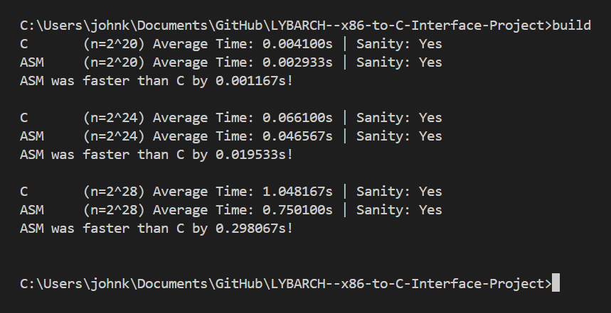

# Performance Analysis for SDOT Kernel

This repository contains C and x86-64 assembly implementations for the SDOT kernel. The purpose of this README is to provide an analysis of the performance of these implementations in both debug and release modes.


## Deployment

To run the this repository:
1. Open your terminal to the appropriate folder.
2. 
``` console
    build 
```
    > Note running build will follow with the execution of main.c, however it is still possible to run main.c again.

# Performance Analysis

## Debug Mode

In debug mode, the focus is on correctness rather than performance optimization. The program output includes the correctness check for both C and x86-64 assembly implementations.

## Release Mode
In release mode, optimizations are applied to enhance performance. The program output includes comparative execution time and a short analysis of the performance of the kernels.

## C Implementation Performance:
Input Size (n=2^20): Average Time: 0.004333s | Sanity: Yes
Input Size (n=2^24): Average Time: 0.073733s | Sanity: Yes
Input Size (n=2^28): Average Time: 1.258000s | Sanity: Yes

## x86-64 Assembly Implementation Performance:
Input Size (n=2^20): Average Time: 0.004000s | Sanity: Yes
Input Size (n=2^24): Average Time: 0.062933s | Sanity: Yes
Input Size (n=2^28): Average Time: 1.160467s | Sanity: Yes
Performance Comparison
The performance analysis is conducted for different input sizes (n = 2^20, n = 2^24, n = 2^28) to evaluate the efficiency of both implementations.

## C vs. Assembly Performance:
For each input size, the average execution time and sanity check results are compared between the C and assembly implementations.
The difference in execution time between the two implementations is calculated and displayed.
Summary of Performance Comparison
Input Size (n=2^20): Assembly was faster than C by 0.000333s!
Input Size (n=2^24): Assembly was faster than C by 0.010800s!
Input Size (n=2^28): Assembly was faster than C by 0.097533s!

## Conclusion
Based on the performance analysis, it can be observed that the assembly implementation consistently outperforms the C implementation across different input sizes. This suggests that optimizing critical sections of code through assembly language can significantly improve performance, especially in computationally intensive tasks like the SDOT kernel.


## Screenshot of C and x86-64



